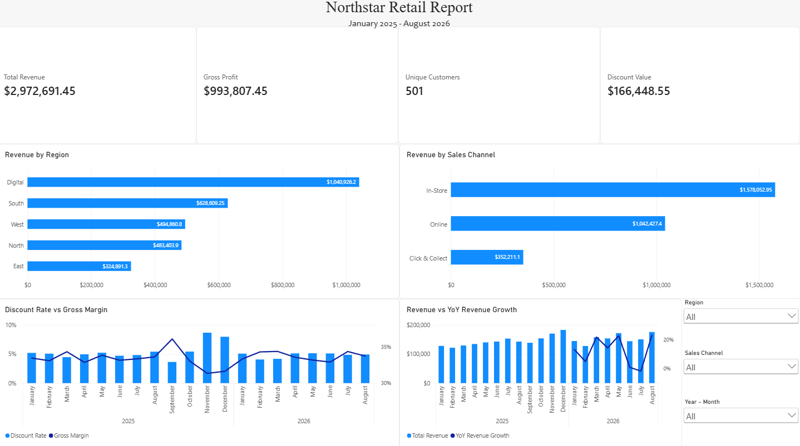

# Northstar Retail Sales Analysis

## Project Overview

This project is an end-to-end Power BI analysis of Northstar Retail sales data covering **January 2025 to August 2026**.

The goal was to build a reliable analytical model, create an executive-level dashboard, and investigate meaningful changes in revenue and profitability rather than simply report totals.

The project includes data cleaning in Power Query, dimensional modelling, DAX measures, time-intelligence analysis, and investigation of business performance.

## Dashboard

The final dashboard contains:

- Total Revenue
- Gross Profit
- Unique Customers
- Discount Value
- Revenue by Region
- Revenue by Sales Channel
- Discount Rate vs Gross Margin over time
- Revenue vs YoY Revenue Growth
- Interactive Region, Sales Channel, and Year/Month slicers



## Tools Used

- Power BI Desktop
- Power Query
- DAX
- Excel source data

## Data Preparation

Several data-quality issues were identified before modelling:

- Converted date fields that had been imported as whole numbers into proper Date types.
- Standardized inconsistent `SalesChannel` values using text cleaning.
- Identified a duplicate `TransactionID`, verified that both records were completely identical, and removed the duplicate.
- Found a Sales transaction referencing customer `C9999`, which was missing from the customer dimension.
- Added an **Unknown Customer** member for `C9999` so the valid transaction could be preserved without breaking referential integrity. Unknown attributes were retained as unknown rather than inventing unavailable customer information.

A key part of preparation was confirming table grain before creating relationships.

## Data Model

The model contains two fact tables at different grains:

- **Sales** — one row per sales transaction.
- **Targets** — one row per Month × Region × Sales Channel target.

Shared dimensions were used instead of merging targets into transaction-level sales data.

The model includes:

- Calendar
- Customers
- Products
- Stores
- Region
- Sales Channel
- Sales fact
- Targets fact

This prevents monthly target values from being duplicated across individual transactions.

## Key DAX Measures

Representative measures used in the project include:

```DAX
Total Revenue =
SUM(SalesTable[Revenue])

Gross Profit =
[Total Revenue] - [Total Cost]

Gross Margin =
DIVIDE(
    [Gross Profit],
    [Total Revenue]
)

Unique Customers =
DISTINCTCOUNT(SalesTable[CustomerID])

Potential Revenue =
SUMX(
    SalesTable,
    SalesTable[Quantity] * RELATED(ProductsTable[ListPrice])
)

Discount Value =
[Potential Revenue] - [Total Revenue]

Discount Rate =
DIVIDE(
    [Discount Value],
    [Potential Revenue]
)

Previous Year Revenue =
CALCULATE(
    [Total Revenue],
    SAMEPERIODLASTYEAR(CalendarTable[Date])
)

YoY Revenue Change =
[Total Revenue] - [Previous Year Revenue]

YoY Revenue Growth % =
DIVIDE(
    [YoY Revenue Change],
    [Previous Year Revenue]
)
```

## Key Findings

### 1. Heavy discounting coincided with margin compression in late 2025

November and December 2025 recorded the highest discount rates in the analysis period at approximately **8–9%**, while gross margin fell to approximately **31%**.

A comparison with September 2025 showed that the margin decline was not primarily caused by a shift toward lower-margin product categories. Category ordering remained broadly consistent, while individual category margins in December were approximately **2–5 percentage points lower** than in September.

This suggests that heavier discounting was the main contributor to the late-2025 margin compression.

### 2. June and July 2026 interrupted otherwise strong YoY growth

Most months in 2026 recorded approximately **10–20% YoY revenue growth**, but performance weakened sharply in the middle of the year:

- June growth fell to below 1%.
- July moved into negative YoY growth.
- August rebounded strongly to approximately 23% growth.

The June slowdown was concentrated in the **South region**, where all three stores recorded approximately **50–90% YoY revenue declines**.

In July, South began recovering unevenly: Hyderabad recorded strong positive growth, Chennai returned to approximately the previous year's level, while Bengaluru remained significantly negative. At the same time, weakness spread across other physical regions. West performed relatively better, but its smaller absolute revenue contribution was insufficient to offset declines in larger regions.

The available sales dataset identifies where the deterioration occurred, but it does not contain operational variables such as inventory availability, store closures, staffing, or regional campaigns that would establish the underlying cause.

## Data Limitation: Regional Online Targets

The Targets table contains Online revenue targets for South, West, North, and East.

However, Online transactions in the Sales data are assigned to a generic `WEB` store with the region `Digital`. There is no reliable field identifying which target region an individual Online transaction belongs to.

Therefore:

- Company-wide Online Actual vs Target analysis is valid.
- Regional In-Store and Click & Collect comparisons can be supported.
- Regional Online Actual vs Target comparisons cannot be reliably calculated from the supplied data.
- Overall regional Actual vs Target comparisons would also be misleading because regional targets include Online targets while regional actuals do not include those Online transactions.

For this reason, a regional target-achievement visual was intentionally excluded from the final dashboard rather than presenting a technically calculable but semantically misleading comparison.

## Validation

With no report filters applied:

- **Total Revenue:** $2,972,691.45
- **Gross Profit:** $993,807.45
- **Gross Margin:** 33.43%
- **Unique Customer IDs:** 501, including the Unknown Customer record
- **Discount Value:** $166,448.55
- **Discount Rate:** 5.30%

The percentage measures were reconciled against their underlying absolute measures as a final sanity check.

## Repository Structure

```text
northstar-retail-power-bi/
├── README.md
├── PowerBIFinalProject.pbix
├── data/
│   └── Northstar_Electronics_Power_BI_Final_Project.xlsx
└── images/
    └── northstar-dashboard.png
```

## Notes

This project was created as a portfolio project to demonstrate an end-to-end Power BI workflow: data-quality investigation, Power Query transformation, dimensional modelling, DAX, time intelligence, dashboard design, and business analysis.
